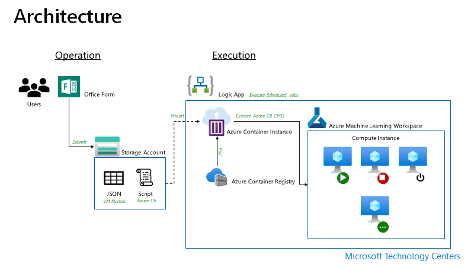
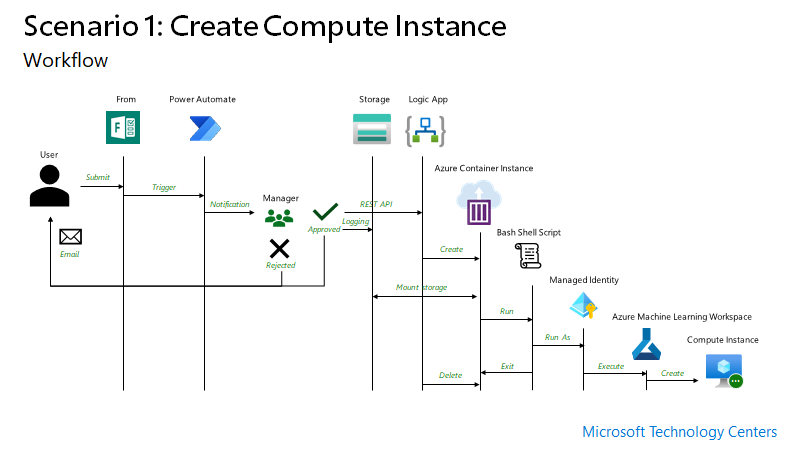
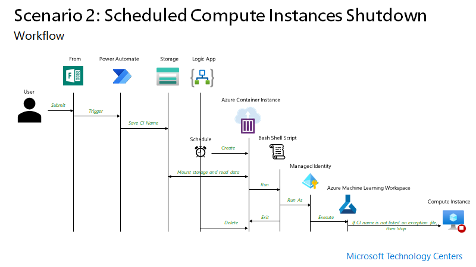

# Manage Azure Machine Learning Compute Insatance

AML (Azure Machine Learning Service) is a data science platform for data scientists. The data scientists need one or more CI (Compute Instances) for different projects or experiments. Although the they are responsible for managing CI, sometime they forget that machines is on for nothing. If GPU attached machine or large size of machines are used, he cost of these unused CIs could be $ 1,000+ a week. 

Automated management of CIs in Azure Machine Learning Workspace is limited today. It doesn't support auto-start nor auto-stop. Even native Azure Cli doesn't support managing CIs.

Other than AML Stuio, another way you can manage CIs is using Azure Cli with ML extension. But another potential problem could be that automated turning the CIs off has to be run on scheduled base without human intervention. 

Not only that users need to manage exceptions to keep CIs overnight for long-running model training.

## Challenge 

To do data science projects, the data scientists need different experiment environments, like real scientists need isolated rooms for their experiments. The data scientists need different type of model training environment. A business problem can be solved by various algorithms so finding the best among many algorithms is what the data scientists do. For example, there are deep learning algorithms require GPU for model training. In this case the data scientists need machine with GPU. On the other hand, other algorithms are optimized on CPU but it may require a large memory to process.
Because of this nature, it is easy to find a pattern that a data scientist is using one or more development environment for their work. In addition to that if the data scientist works on multiple projects, then they need more development environments.

After projects are done, those environments needed to be revoked or stopped when they are not using it. But it is not easy to terminate the environment right after the project because there are some artifacts that need to be collected or moved some place for next projects.

Azure Machine Learning allows data scientists create the isolated development environment with a concept of CI (Compute Instance) [1]. CI is a type of Managed Virtual Machine for data scientists. When a project begins, CI will be created for the data scientist development environment. And they will create another CI for another project or experiment with larger size or hardware specification. Then it can become a CI sprawl. The worst case can be an expensive GPU machine turned on and nothing happens during the weekends. And, in terms of cost, this can be a bad case to expenses.

This situation must be managed. From infrastructure management point of view, the creating NEW CI  permission from data scientists need to be revoked[2] and there should be an approval process placed. So, when data scientist needs CI they can make request one to infrastructure team or their manager. Also a tool is needed to apply a rule to turn CIs off when they are not being used.

Today Schedule based CI stopping is in private preview. It can start and stop CI with a given day and time. But it does not allow an exception of the rule. For example, if the model training begun and the model training need to be run over a night or multiple day, the stopping CI must be paused for a while for the specific CI.
With this condition, we had to produce the better solution that controlling compute resources and providing flexibility to data scientists.
References

> [1] Microsoft, ["Azure Machine Learning Compute Instance"](https://docs.microsoft.com/en-us/azure/machine-learning/concept-compute-instance)
>
> [2] Microsoft, ["Manage access to an Azure Machine Learning workspace"](https://docs.microsoft.com/en-us/azure/machine-learning/how-to-assign-roles#create-custom-role)

## Solution

An objective is create a job that turns off Compute Instances in Azure Machine Learning Workspace at midnight to save cost.

To make the job automate, the job will be triggered by logicapp/functions and a shell script will be executed.

A form will be provided to users to make exception request to prevent long running training job termination in a particular CI,

To have an execution environment, build a custom docker image that has Azure Cli with ML extension and shell script.

The image will be provisioned based on schedule and execute the script.

### Solution Architecture

### Create Compute Instance 

### Stop Compute Instance

You can stop CI (Compute Instances) using azure cli ml extension.

> You can reuse this approach to turn CI on in the week day monrning.

