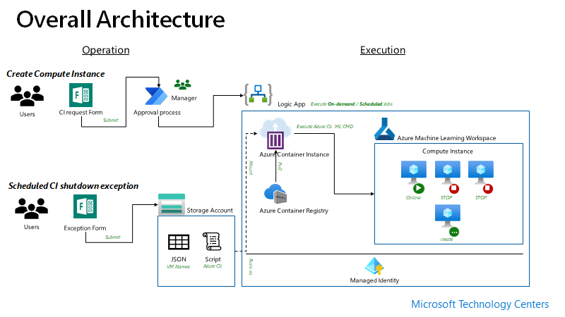

# Manage Azure Machine Learning Compute Insatance

## Challenge

AMLS (Azure Machine Learning Service) is a data science platform for data scientists. The data scientists is using one or more CI (Compute Instances) in AMLS for different projects. Although the they are full responsible for manage CI, sometime they forget that machines is on and nothing is run. The cost of these unused CIs could be $ 1,000 a week. When they foresee the growth of Azure Machine Learning usage, they begun to worry about cost of underutilized compute resources.

Managing Compute Instance in Azure Machine Learning Workspace is limited today. It doesn't support auto-shutdown nor auto-scale. Even native Azure Cli doesn't support managing CIs in AMLS.

A way to manage CIs is using Azure Cli with ML extension. But another potential problem could be that turning off the CIs has to be run on scheduled base without human intervention. 

Not only that users need to manage exceptions to keep CIs overnight for long-running model training.

## Solution

An objective is create a job that turns off Compute Instances in Azure Machine Learning Workspace at midnight to save cost.

To make the job automate, the job will be triggered by logicapp/functions and a shell script will be executed.

A form will be provided to users to make exception request to prevent long running training job termination in a particular CI,

To have an execution environment, build a custom docker image that has Azure Cli with ML extension and shell script.

The image will be provisioned based on schedule and execute the script.

### Solution Architecture

### Stop Compute Instance

You can stop CI (Compute Instances) using azure cli ml extension.

As you can't control CIs with REST

### Create Compute Instance 
